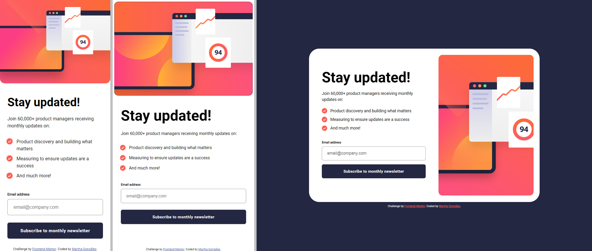
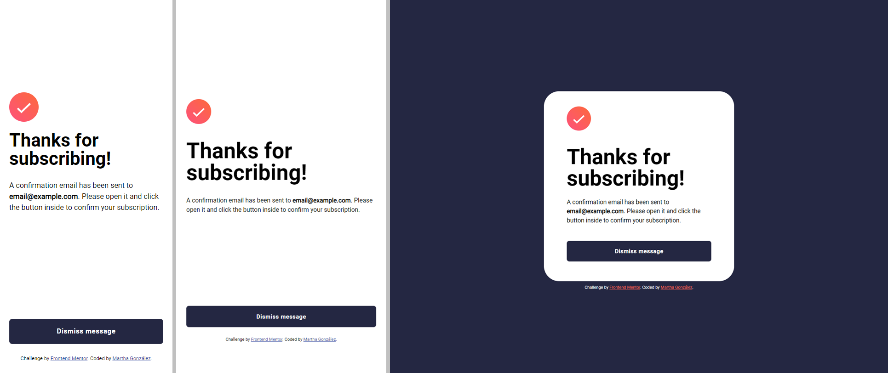

# Frontend Mentor - Newsletter sign-up form with success message solution

This is a solution to the [Newsletter sign-up form with success message challenge on Frontend Mentor](https://www.frontendmentor.io/challenges/newsletter-signup-form-with-success-message-3FC1AZbNrv). Frontend Mentor challenges help you improve your coding skills by building realistic projects. 

## Table of contents

- [Overview](#overview)
  - [The challenge](#the-challenge)
  - [Screenshot](#screenshot)
  - [Links](#links)
- [My process](#my-process)
  - [Built with](#built-with)
  - [What I learned](#what-i-learned)
  - [Continued development](#continued-development)
  - [Useful resources](#useful-resources)
- [Author](#author)
- [Acknowledgments](#acknowledgments)

## Overview

### The challenge

Users should be able to:

- Add their email and submit the form
- See a success message with their email after successfully submitting the form
- See form validation messages if:
  - The field is left empty
  - The email address is not formatted correctly
- View the optimal layout for the interface depending on their device's screen size
- See hover and focus states for all interactive elements on the page

### Screenshot

From left to right:

- Mobile: 375px
- Tablet: 540px
- Desktop: 1440px

### Links

- Solution URL: [Repository](https://github.com/margga88/newsletter-signup)
- Live Site URL: [Live here](https://margga88.github.io/newsletter-signup/)

## My process

### Built with

- Semantic HTML5 markup
- CSS custom properties
- Flexbox
- CSS Grid
- Mobile-first workflow
- Cube CSS methodology

### What I learned

- This challenge was quite a good one. It took far more testing than I've ever done before. Blame the old designer eyes for noticing the details everytime I thought I was done.
- Had to review about layouts and containers in the process when after all was done, the layout wouldn't resize correctly. However, this helped to notice the way they work, especially when applying semantic HTML.
- Relearning about validation on JavaScript was yet another thing. I highly recommend reviewing form validation if you have your doubts on where to even start before hitting this challenge.

### Continued development

I'm definitely looking forward to more challenges like this one, it was a test of both knowledge, problem-solving skills and patience with myself, also it gave me further reference on how to manage my work time in a healthy way.

### Useful resources

- [CSS Tricks | Sticky Footer, Five Ways](https://css-tricks.com/couple-takes-sticky-footer/) - Quite helpful when rethinking the responsive layout.
- [GeeksforGeeks | JavaScript Form Validation](https://www.geeksforgeeks.org/javascript/form-validation-using-javascript/) - This served as a good example to work on the JavaScript file. 
- [MDN | Outline](https://developer.mozilla.org/en-US/docs/Web/CSS/outline) - This was helpful to work on the focus state required.

## Author

- Frontend Mentor - [@margga88](https://www.frontendmentor.io/profile/margga88)

## Acknowledgments

My thanks go to my screen, for being old and still alive as it deteriorates, also to the Frontend Mentor community for one of the tips I've applied in this project and will be applying from now on.